Getting started with Palladio
=============================

Palladio (palladio.designhumanities.org), a product of Stanford’s
Humanities + Design Lab, is a web-based visualization tool for complex
humanities data. Think of Palladio as a sort of Swiss Army knife for
humanities data. It’s one package that includes a number of tools, each
of which allows you to get a different angle on the same data.

Palladio is relatively new and still under active development which
means that you will almost certainly encounter bugs! Still, it’s a very
useful tool for getting a handle on a complicated dataset.

**When Might Palladio be the Right Tool for You?**

**You have structured data.**

Here, “structured data” means “data in a spreadsheet”: categorized,
sorted, and stored in an Excel document or some other kind of
spreadsheet application.

**You’re interested in time, space, and relationships.**

That’s where Palladio excels: showing you how various entities are
connected across time and space.

**Your data has many attributes.**

Palladio’s really good at helping you uncover relationships among
disparate attributes over time and space. For example, it can help you
see that a diarist was especially interested in trees as he traveled
through North Carolina, and especially interested in bats as he traveled
through Arizona. Palladio allows you to drill down through your data
using faceted browsing.

**When Might Palladio Not be the Right Tool for You?**

**You have unstructured data.**

If you’re trying to analyze a long text, like a poem or a novel,
Palladio won’t help you much. You’ll want to look for text analysis
tools, like Voyant (http://voyant-tools.org/).

**You just want to count things.**

If you just want to make relatively simple charts and graphs, like a bar
or pie chart, Palladio is too much tool for you! Instead, try using
Excel’s built-in functions.

**You want to present an interactive visualization.**

One big limitation of Palladio is that you can’t embed or share the
visualizations you create, except in static form. So while Palladio can
help you explore and understand your data, it’s not great for
presentation, at least not yet. Instead, try Google Fusion Tables, Plot.ly, or Tableau.

**You want to create complex, fine-tuned maps and networks graphs.**

While Palladio can produce maps and network graphs, you can’t customize
them to any great extent, and you can’t perform sophisticated network
analysis, such as calculating centrality. Instead, you might consider
more sophisticated mapping tools, such as CartoDB or ArcGIS, and more
sophisticated network analysis tools, such as Gephi and Cytoscape.

**You hate bugs.**

Palladio is still a baby, and you will almost certainly encounter some
bugs. If you prefer not to use unstable software, you might investigate
Google Fusion Tables or Tableau.

With that out of the way, we're almost ready to get started using
Palladio. First, though, a quick note that this tutorial does *not*
cover some important features of Palladio, specifically its ability to
link multiple data tables together, its timespan feature, and a new
feature that allows you to use multiple basemaps. Perhaps these will be
the subject of a later tutorial!

A word on the dataset we'll use, which you can find here
(https://www.dropbox.com/s/rn40mchgrusip0x/Cushman-Collection.csv?dl=0).
This is a spreadsheet that contains the metadata for a portion of the
Charles Weever Cushman Collection of photographs, located at Indiana
University (http://webapp1.dlib.indiana.edu/cushman/index.jsp). The full
Cushman Collection contains more than 14,500 Kodachrome photographs,
taken between 1938 and 1969. Indiana University's archivists were
forward-thinking enough to place this data on Github
(https://github.com/iulibdcs/cushman\_photos), which is how we're able
to use it.

In order to make this data a little easier to work with, I've limited
this spreadsheet to photographs taken between 1938 and 1955. I've also
removed the "End Date" field to prevent confusion, changed the format of
the date field, and added geocoordinates so that we can map the data
more easily. For a great introduction to how to do some of this data
manipulation on your own data, see this handout, developed by Owen
Stephens on behalf of the British Library, which explains how to use the
data-cleaning application OpenRefine.
(https://www.dropbox.com/s/dkk4yjpc38wlpcx/Introduction%20to%20OpenRefine%20handout.pdf?dl=0)

A reminder that Palladio is still under development, so it can be buggy
and slow! Some tips:

-   Work slowly. Wait for an option to finish loading before you click
    it again or click something else.

-   **Do not refresh the page.** You'll lose your work.

-   On a related note: To start over, refresh the page.

-   Clicking on the **Palladio** logo will bring you to the Palladio
    homepage, but it won't erase your work.

Navigate to Palladio.
---------------------

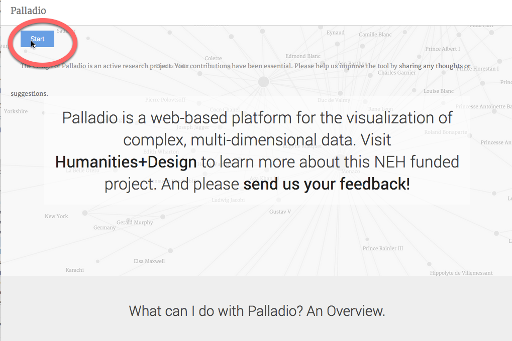

Go to palladio.designhumanities.org and click on **Start**.

Upload your spreadsheet.
------------------------

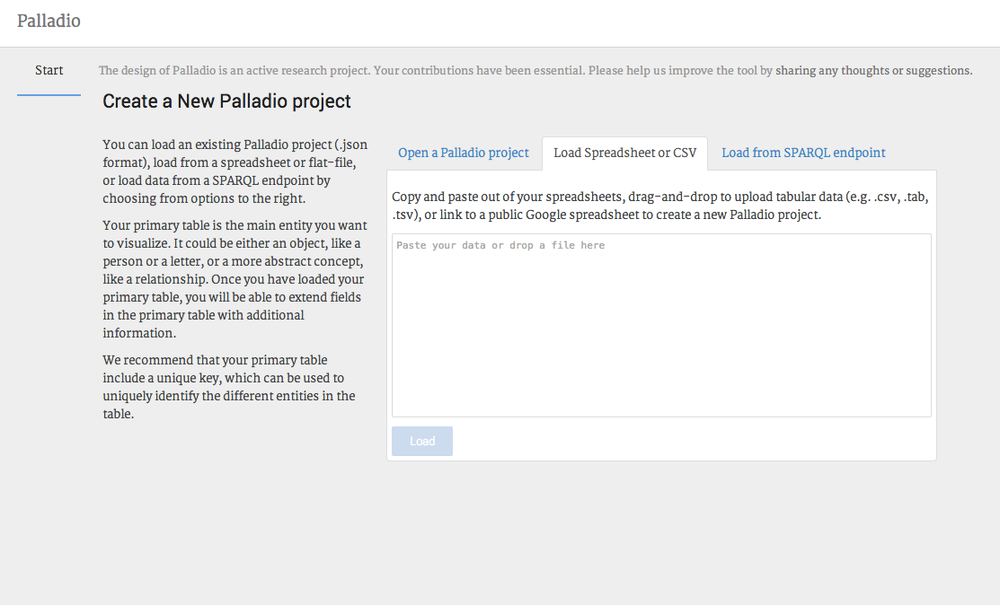

Click on the **Load Spreadsheet or CSV** tab and drag your spreadsheet
onto the tab. (If you have an Excel spreadsheet, save it as a .csv file
before uploading it.) Then press **Load**.

Hey, you imported your data!
----------------------------

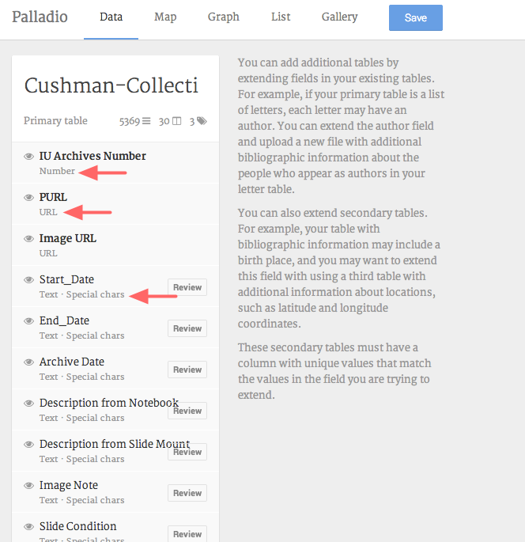

As you can see, each column in your spreadsheet is a different category
of data. If you look closely, you'll see that Palladio has automatically
categorized your data as different datatypes: "IU Archives Number" is a
**number**, for example, while "PURL" is a **URL**. And if you scroll
down, you'll see that "Geocoordinates" is **coordinates**.

Tell Palladio what kind of data you have.
-----------------------------------------

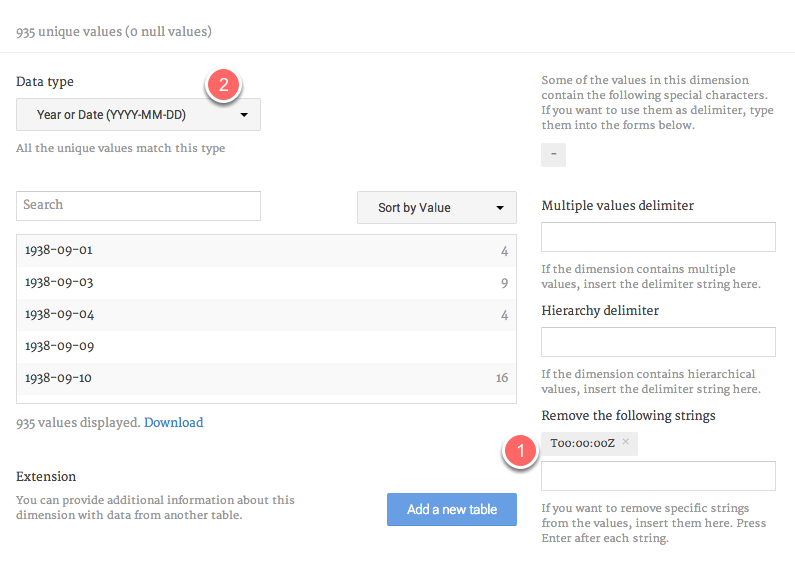

One of your data categories is a date, but Palladio hasn't figured that
out right away. We need to tell it.

Click on the tiny **Review** button just to the right of the **Date**
category. This window allows you to edit your data a bit. You have some
extra characters attached to your date information, and we need to get
rid of them. In the **Remove the following strings** field **(1)** type
in T00:00:00Z and press enter. Wait a moment; the characters should be
removed from your data. Now, in the **Data Type** dropdown menu **(2)**,
choose **Year or** **Date (YYYY-MM-DD)**. Now close the window.

Map your data!
--------------

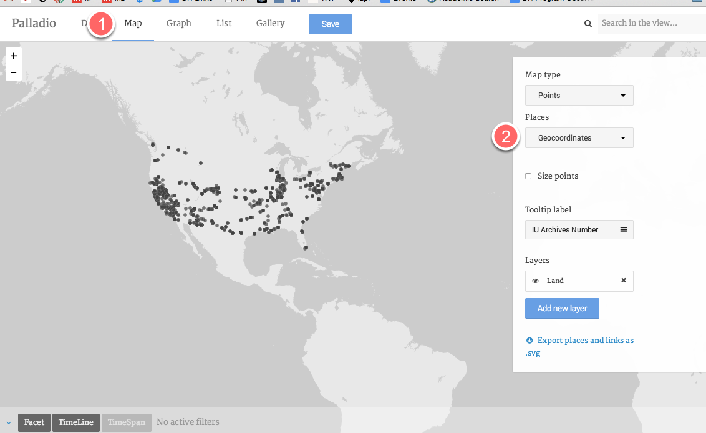

Click on the **Map** tab at the top of the window to go to the maps view
of your data. From the **Places** dropdown window, choose
**Geocoordinates**. Hey, you have a map!

Tip: Move this screen slowly and give the points a minute to repopulate
the map once you've moved. This can take a moment or two.

Combine your map with a timeline.
---------------------------------

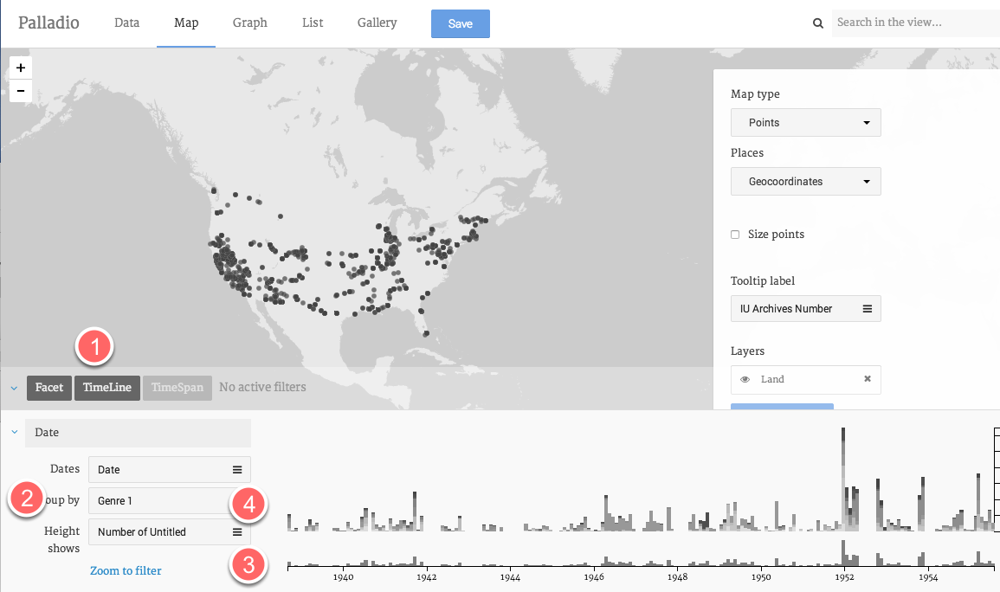

Start by clicking on **Timeline** tab **(1).** Group your data by
**Genre 1 (2)**. Now you can see the distribution of photos over time.
The bottom graph **(3)** is the overview of the timespan; the upper
graph **(4)** shows a little more detail. If you hover over the columns
on the upper graph, you can get a sense of the distribution of genres.

Filter your data by date.
-------------------------

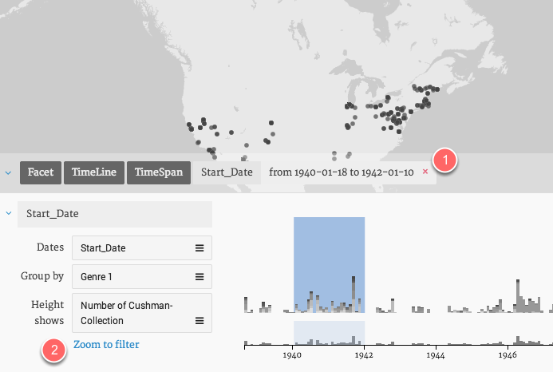

On the bottom graph, use the crosshairs to drag (slowly!) from 1940 to
1942. A blue box appears to indicate that you're filtering your data by
date. The points on the map change to correspond with the timespan. To
get rid of the date filter, click on the pink "x" next to the datespan
above the graph **(1).** You can also click on **Zoom to filter** to
zoom in on the timespan you've selected **(2).**

Add a facet to further refine your data.
----------------------------------------

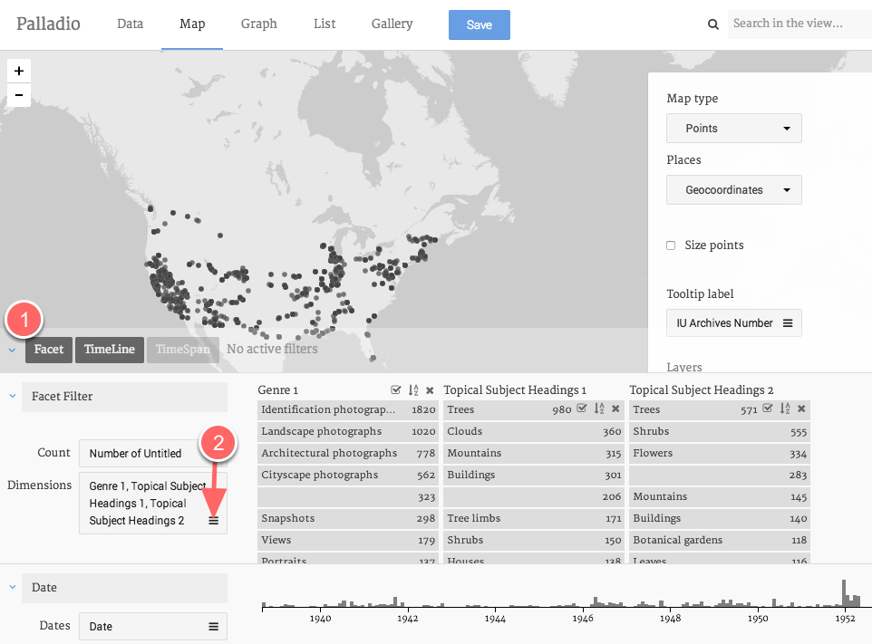

You've now narrowed your data down to 1940–1942. Now let's look at some
other ways to filter your data.

Click on the **Facet** tab **(1).** (You'll probably want to compress
your Timeline window by clicking on the two arrows that appear on the
upper right-hand corner of the pane.)

Click on the **Dimensions** menu **(2).**

Now select **Genre 1**, **Topical Subject Heading 1**, and **Topical
Subject Heading 2**.

Explore your facets.
--------------------

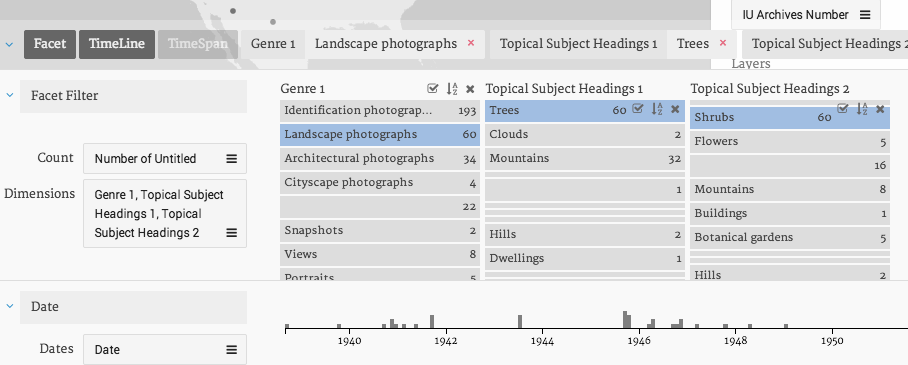

Working from left to right, the facet dimensions gradually narrow down
the data displayed on the map. For example, in the image above, the map
will show where Cushman took landscape photographs of trees and shrubs.

Explore your data as a gallery.
-------------------------------

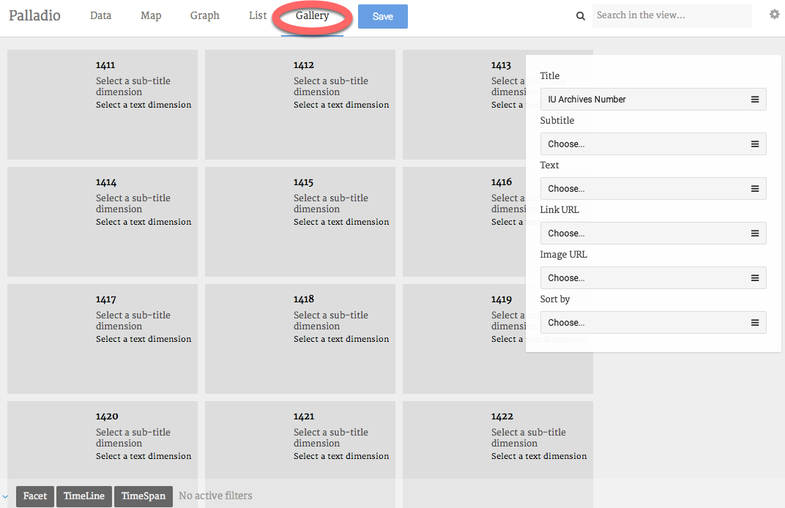

Maps are fun, but galleries can be useful, too. First, **delete your
time and facet filters** by clicking on the tiny pink garbage can that
appears at the upper right-hand corner of each pane.

Now, click on the **Gallery** tab at the top of your window.

Change the categories your gallery displays.
--------------------------------------------

So far, not very useful. Let's change the categories your gallery is
displaying. For **Title**, choose **City and State**. For **Subtitle**,
choose **Genre 1**. For **Text**, choose **Description from Notebook**.
For **Link URL**, choose **PURL**. For **Image URL**, choose **Image
URL**. If you'd like, you can sort your gallery by **Date**.

Filter your gallery by date and other attributes.
-------------------------------------------------

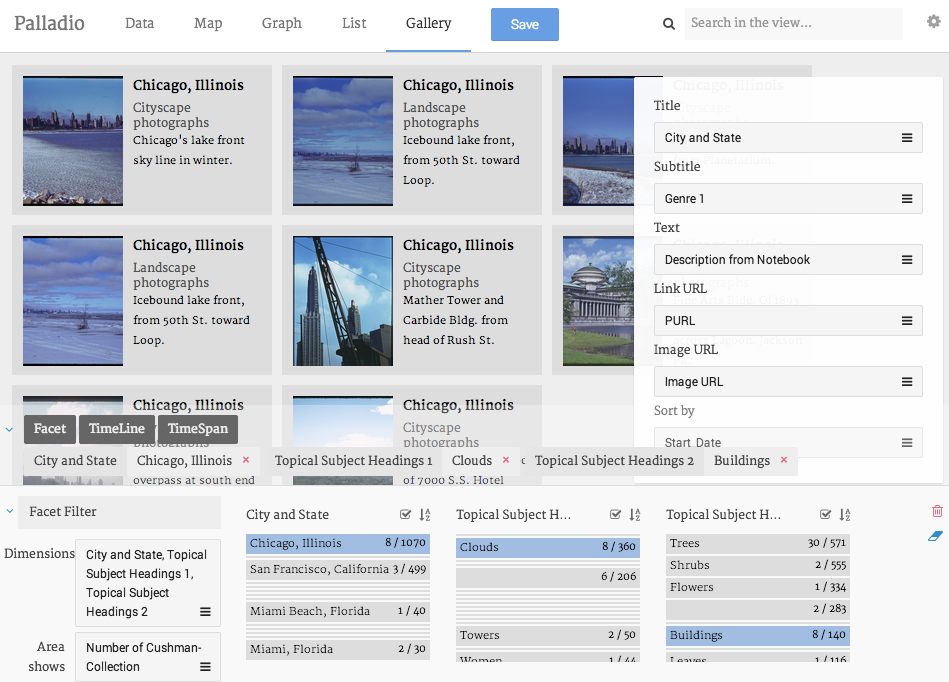

You can filter your gallery in the same way that you filter your map.
For example, in the above image, I'm looking at pictures taken in
Chicago that contain both clouds and buildings.

View your data as a network diagram.
------------------------------------

Network diagrams are good for showing the relationships among entities.
To view your data as a network diagram, get rid of your filters and then
click on **Graph**.

Set the parameters of your network diagram. 
--------------------------------------------

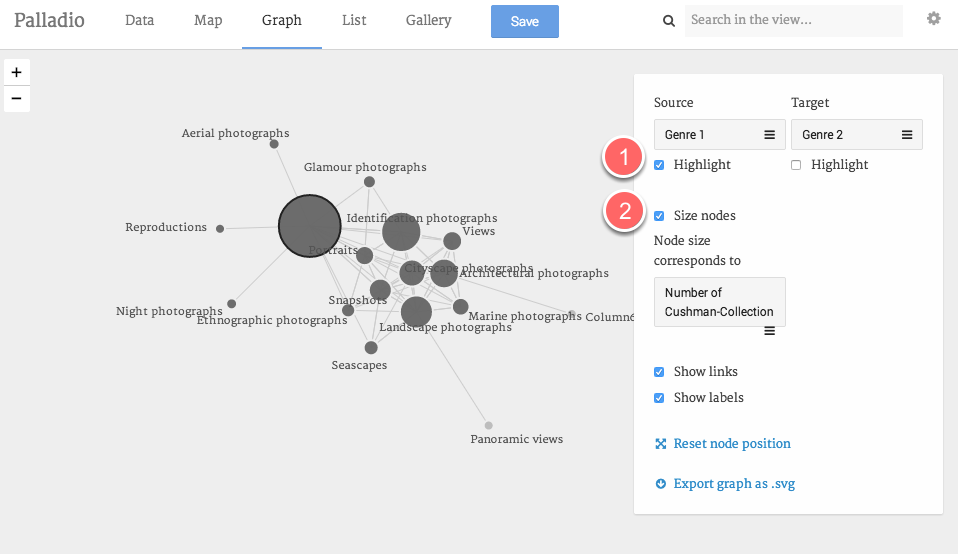

In order to create a network diagram, you need to tell Palladio which
two attributes of your data you want to explore. For **Source**, choose
**Genre 1**; for **Target**, choose **Genre 2**. Now you can see which
genres tend to co-occur in Cushman's photographs. You can click and drag
the nodes (the circles) to explore your diagram.

To highlight one kind of node in order to distinguish between the two,
click on the **Highlight** checkbox **(1)**. To size nodes according to
the number of objects the represent, click on the **Size nodes**
checkbox **(2)**.

And you can filter your diagram in the same way you filtered your map
and gallery.

Share your work.
----------------

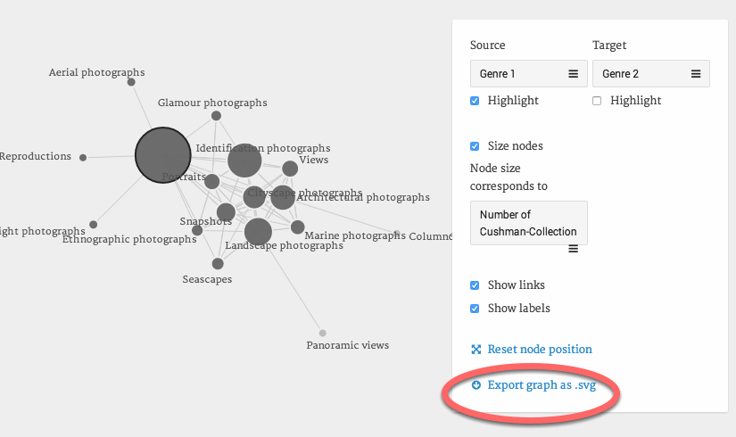

Unfortunately, you can't embed interactive Palladio diagrams on
webpages, but you can produce static images, either by taking a
screenshot or clicking on the **Export as .svg** link. An svg is an
image, and you can post it or share it as you like.

Save your work.
---------------

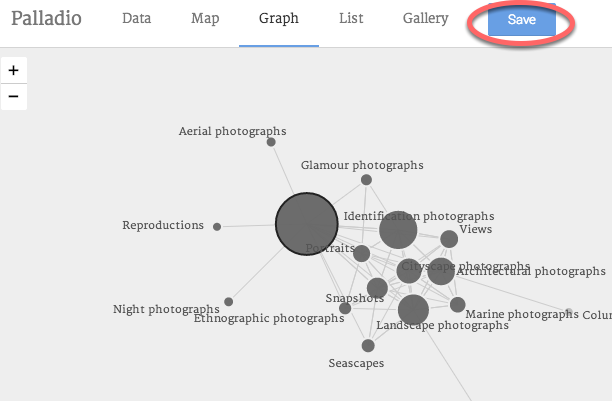

Palladio doesn't save your data, but you can export your **data model**
— the way you configured your data **—** and upload it again later. To
do this, click on **Save**. This will download a file with the extension
.json. The next time you use Palladio, you can upload this file (on the
Palladio homepage) in order to open your project where you left off.
